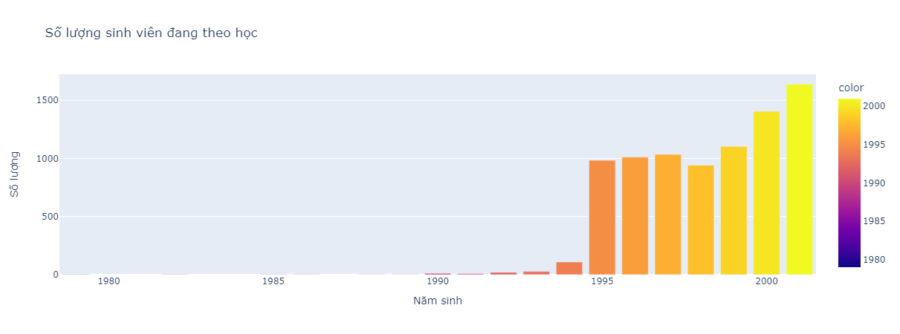

# Đồ án môn học "Phân tích dữ liệu và Ứng dụng"
## Nhóm 10
**Danh sách sinh viên thực hiện:**
1. 19522525 - Nguyễn Văn Vinh
2. 20520239 - Nguyễn Hoàng Long
3. 20521881 - Trần Nguyễn Nhật Tân
4. 21520352 - Trần Xuân Minh
5. 21520800 - Lê Thu Hà
---
<<<<<<< HEAD

=======
# Phần 1: Tìm hiểu và phân tích dữ liệu trong folder `Education Dataset-v2`
>>>>>>> 5e562fe9f5659714c01e9cb8d6251bc973eb574c
